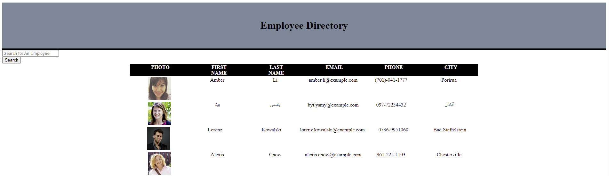

# Employee Directory

## Description
This project is a simple react application that searches and displays a group of (random) employees pulled from the 
Random User API.

This project was bootstrapped with [Create React App](https://github.com/facebook/create-react-app).

## Screenshot

The following image displays the appearance and functionality of the application:

## Deployed Application:

This app is deployed using GitHub Pages: https://almurawski15.github.io/user-directory/

## Technologies

React.js, Random User API, HTML, CSS

